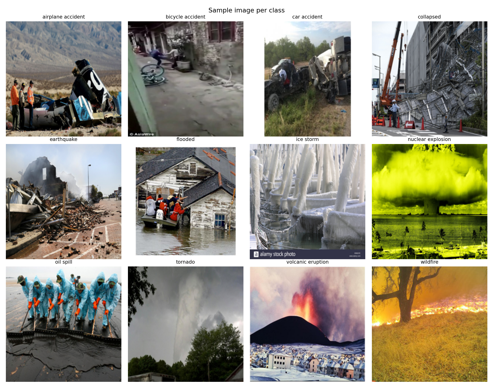
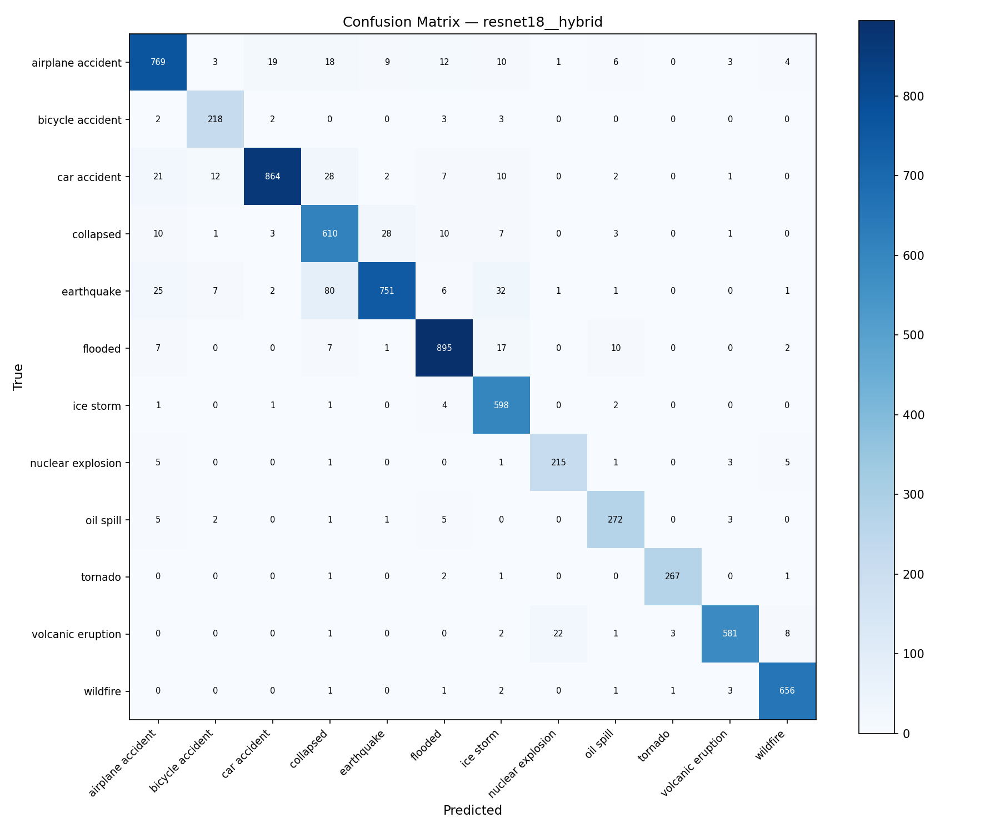
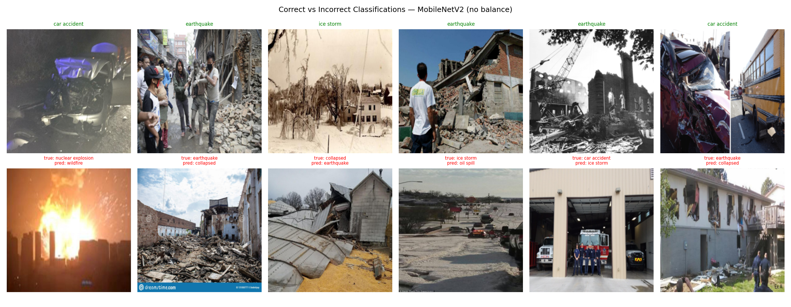
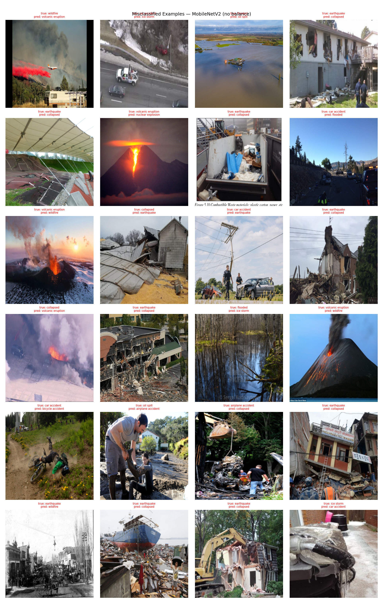

# Incident Recognition in Images — Classification Report

---

## 1. Introduction

### Problem
Automatic recognition of incident types from images is a challenging computer vision problem with real-world applications in emergency response, social media monitoring, and disaster management. Images of incidents are visually diverse, often ambiguous, and collected under uncontrolled conditions.

### Objective
This project aims to classify images into one of 12 incident categories using deep learning with transfer learning. We evaluate two architectures (MobileNetV2 and ResNet18) across three class imbalance handling strategies, using stratified 5-fold cross-validation to produce reliable performance estimates.

---

## 2. Dataset Description

### Classes and Image Counts

| Class | Count |
|---|---|
| airplane accident | 854 |
| bicycle accident | 228 |
| car accident | 947 |
| collapsed | 673 |
| earthquake | 906 |
| flooded | 939 |
| ice storm | 607 |
| nuclear explosion | 231 |
| oil spill | 289 |
| tornado | 272 |
| volcanic eruption | 618 |
| wildfire | 665 |
| **Total** | **7,229** |

### Sample Images

### Class Imbalance
The dataset is significantly imbalanced. The ratio between the largest class (car accident, 947) and the smallest (bicycle accident, 228) is approximately 4:1.

- **Majority classes** (>800): car accident, flooded, earthquake, airplane accident
- **Mediority classes** (600–800): wildfire, collapsed, volcanic eruption, ice storm
- **Minority classes** (<300): bicycle accident, nuclear explosion, tornado, oil spill

### Preprocessing and Cleaning
All images were loaded and resized to **224×224 pixels** (RGB). 5 files were skipped due to corruption or unreadable formats. The final dataset contains **7,229 valid images** stored as uint8 arrays in the range [0, 255].

During model training, images are normalized using ImageNet mean `[0.485, 0.456, 0.406]` and standard deviation `[0.229, 0.224, 0.225]` per RGB channel. These values are the mean and standard deviation of pixel intensities computed across the entire ImageNet training set. Since our models were pre-trained on ImageNet, their weights were optimized with inputs normalized this way — reusing the same normalization ensures our inputs match the distribution the pre-trained features expect, which is essential for effective transfer learning.

### Split Strategy
Stratified 5-fold cross-validation was used. With k=5, each fold assigns **~80% of data to training and ~20% to validation**, while preserving the class distribution in both splits. No separate held-out test set was used; all evaluation is performed on the validation folds.

---

## 3. Methods

### MobileNetV2 (Transfer Learning)
MobileNetV2 is a lightweight convolutional architecture designed for efficiency. It uses depthwise separable convolutions and an inverted residual structure with linear bottlenecks. Pre-trained on ImageNet (1.28M images, 1000 classes), the final classifier head was replaced with a linear layer mapping to 12 classes.

**Why selected:** Strong ImageNet pre-training, computationally efficient, well-suited for medium-scale datasets where full fine-tuning of a large model would risk overfitting.

### ResNet18 (Transfer Learning)
ResNet18 is a residual network with 18 layers. Its skip connections address the vanishing gradient problem and enable deeper feature learning. Pre-trained on ImageNet, the final fully connected layer was replaced with a 12-class output layer.

**Why selected:** Classic, well-understood baseline architecture. Provides a direct comparison point against MobileNetV2 to assess whether a more complex residual structure improves incident classification.

---

## 4. Experimental Setup

| Parameter | Value |
|---|---|
| Input image size | 224 × 224 × 3 |
| Optimizer | Adam |
| Learning rate | 1e-4 |
| Epochs per fold | 10 |
| Batch size | 32 |
| Cross-validation | Stratified 5-fold (seed=42) |
| Framework | PyTorch |
| Device | CUDA GPU |

### Data Augmentation
During training, standard augmentation was applied to all training folds for generalization:
- Horizontal flip (50% probability)
- Random rotation (±20°)
- Brightness adjustment (factor 0.8–1.2)

**Note:** Augmentation was applied to the training fold only. The validation fold was never augmented or resampled.

### Imbalance Handling Strategies

**Strategy A — No balancing:** Training fold used as-is. No class weights, no resampling.

**Strategy B — Class weights:** Class weights computed per fold from the training fold class frequencies: `w_c = 1 / count_c`, normalized so the weights sum to the number of classes. Applied to `CrossEntropyLoss`. No resampling.

**Strategy C — Hybrid resampling:** Applied only to the training fold. Minority classes are oversampled via augmentation; majority classes are undersampled. Target size is the median class count per fold (~513 images per class, 6,156 total per fold). Validation fold is untouched.

### Evaluation Metrics
- **Accuracy** — overall fraction of correct predictions
- **Macro Precision** — average precision per class, unweighted (treats all classes equally)
- **Macro Recall** — average recall per class, unweighted
- **Macro F1** — harmonic mean of macro precision and recall; primary metric for imbalanced datasets
- **Weighted F1** — F1 weighted by class support
- **Confusion matrix** — full per-class prediction breakdown

All metrics reported as **mean ± standard deviation across 5 folds**.

---

## 5. Results

### Confusion Matrices

All six confusion matrices are saved in the `figures/` directory. They can be viewed inline below (run the save cell in the notebook first to generate the files).

| Configuration | Confusion Matrix |
|---|---|
| MobileNetV2 — no balance |  |
| MobileNetV2 — hybrid |  |
| MobileNetV2 — class weights |  |
| ResNet18 — no balance |  |
| ResNet18 — hybrid |  |
| ResNet18 — class weights |  |

### Summary Table

| Configuration | Accuracy (mean±std) | Macro-P | Macro-R | Macro-F1 | Wtd-F1 |
|---|---|---|---|---|---|
| MobileNetV2 — no balance | **0.8523 ± 0.0090** | 0.8607 | 0.8437 | **0.8503** | **0.8519** |
| MobileNetV2 — hybrid | 0.8435 ± 0.0096 | 0.8467 | 0.8388 | 0.8411 | 0.8441 |
| MobileNetV2 — class weights | 0.8435 ± 0.0064 | 0.8441 | 0.8365 | 0.8376 | 0.8439 |
| ResNet18 — no balance | 0.8097 ± 0.0220 | 0.8172 | 0.8054 | 0.8046 | 0.8077 |
| ResNet18 — hybrid | 0.8113 ± 0.0240 | 0.8310 | 0.8090 | 0.8128 | 0.8114 |
| ResNet18 — class weights | 0.8429 ± 0.0258 | 0.8525 | 0.8381 | 0.8417 | 0.8415 |

### Per-Class Results — Best Model (MobileNetV2, No Balancing)

Class size categories: **Majority** (>800) · **Average** (600–800) · **Minority** (<300)

| Class | Size | Precision | Recall | F1 | Support |
|---|---|---|---|---|---|
| airplane accident | Majority | 0.86 | 0.80 | 0.83 | 854 |
| bicycle accident | Minority | 0.93 | 0.82 | 0.87 | 228 |
| car accident | Majority | 0.91 | 0.92 | **0.92** | 947 |
| collapsed | Average | 0.67 | 0.67 | 0.67 | 673 |
| earthquake | Majority | 0.77 | 0.80 | 0.79 | 906 |
| flooded | Majority | 0.88 | 0.92 | 0.90 | 939 |
| ice storm | Average | 0.88 | 0.89 | 0.88 | 607 |
| nuclear explosion | Minority | 0.90 | 0.81 | 0.85 | 231 |
| oil spill | Minority | 0.75 | 0.72 | 0.73 | 289 |
| tornado | Minority | 0.93 | 0.92 | **0.93** | 272 |
| volcanic eruption | Average | 0.89 | 0.91 | 0.90 | 618 |
| wildfire | Average | 0.93 | 0.94 | **0.93** | 665 |
| **macro avg** | | **0.86** | **0.84** | **0.85** | 7229 |
| **weighted avg** | | **0.85** | **0.85** | **0.85** | 7229 |

---

## 6. Error Analysis

### Correct vs Incorrect Examples

**Correct classifications (top row):** The model confidently identifies visually distinct classes — clear smoke plumes, vehicle wreckage, and funnel clouds provide unambiguous features.

**Misclassified examples (bottom row):** Errors cluster around visually ambiguous scenes. Collapsed structures are mistaken for earthquake damage; murky water scenes are confused between oil spill and flooded.

### Hardest Classes
**Collapsed** is the most difficult class across all six models, consistently scoring F1 between 0.59 and 0.68. This is likely due to visual ambiguity: a collapsed building can closely resemble earthquake damage, flooding aftermath, or general structural damage. The class also has a mid-range count (673), so the difficulty is primarily visual rather than a data volume issue.

**Oil spill** is the second hardest (F1 0.65–0.77). Oil spills are visually subtle — dark water surfaces with little structural context — and can be confused with flooded areas or ice storm scenes depending on lighting and angle.

**Airplane accident** shows notably lower recall in ResNet18 without balancing (0.71 vs. 0.80 for MobileNetV2), suggesting ResNet18 misses more airplane accident images in the no-balance setting — the model likely biases toward majority classes when not corrected.

### Easiest Classes
**Tornado** (F1 0.89–0.93), **wildfire** (F1 0.88–0.93), and **car accident** (F1 0.88–0.92) are consistently the easiest across all models. These classes have distinctive visual features: funnels and rotating clouds for tornadoes, visible flames and smoke for wildfires, and vehicle deformation for car accidents.

### Effect of Balancing on Minority Classes

Comparing minority class recall between strategies for MobileNetV2:

| Class | No Balance | Hybrid | Class Weights |
|---|---|---|---|
| bicycle accident | 0.82 | 0.82 | 0.86 |
| nuclear explosion | 0.81 | 0.80 | 0.75 |
| oil spill | 0.72 | 0.75 | 0.73 |
| tornado | 0.92 | 0.91 | 0.92 |

Class weights showed a modest improvement on the smallest class (bicycle accident: 0.82 → 0.86), but no consistent improvement across all minority classes. The gains were not large enough to offset the slight drop in majority class performance, resulting in an overall lower macro-F1 than no balancing.

### ResNet18 Sensitivity to Balancing
ResNet18 is notably more sensitive to the balancing strategy than MobileNetV2. Without balancing it achieves a macro-F1 of 0.8046 with high variance (±0.0250). With class weights it reaches 0.8417, nearly matching MobileNetV2. This suggests ResNet18's feature space is more susceptible to the class frequency signal in the loss function, while MobileNetV2's ImageNet pre-training provides a more robust initialization that compensates without explicit reweighting.

---

## 7. Conclusion

### Best Model
**MobileNetV2 with no balancing** is the best-performing configuration, achieving a macro-F1 of **0.8503 ± 0.0111** and accuracy of **0.8523 ± 0.0090**. It also has the lowest cross-fold variance among all six configurations, indicating it is the most stable and reliable.

### Which Balancing Strategy Works Best
For MobileNetV2, no balancing performs best. The pre-trained features are robust enough that the mild class imbalance (4:1 ratio) does not strongly hurt minority class recall, and neither resampling nor reweighting provides a net benefit.

For ResNet18, class weighting is essential. Without it, the model is the weakest overall (macro-F1 0.8046); with it, it reaches 0.8417 and becomes competitive with MobileNetV2 hybrid/class_weights variants.

### Limitations
- No held-out test set was used. All performance estimates come from cross-validation; generalization to completely unseen data is not directly measured.
- Only 10 training epochs were used per fold. Models may not have fully converged, particularly ResNet18 whose loss curves show more instability (spike patterns visible in later epochs for class_weights and hybrid configurations).
- Augmentation is limited (flip, rotation, brightness). Stronger augmentation (random crops, color jitter, mixup) was not explored.
- The hybrid resampling target (median class size ~513) was applied uniformly across folds; a per-fold adaptive target could improve results.
- No SVM baseline was included, which would have provided a useful non-deep-learning reference point.

### Future Improvements
- Train for more epochs (20–30) with a learning rate scheduler (e.g. cosine annealing) to allow better convergence.
- Try stronger architectures: EfficientNet-B0 or ViT-small, which have strong ImageNet pre-training and may better capture subtle scene-level features needed for ambiguous classes like collapsed and oil spill.
- Apply test-time augmentation (TTA) to improve prediction reliability at inference.
- Use focal loss instead of weighted cross-entropy for minority class handling.
- Investigate misclassified collapsed images explicitly — it is possible a sub-category split (collapsed building vs. collapsed bridge vs. collapsed road) would reveal confounding structure.
- Add a true held-out test set (e.g. 10% stratified split before any CV) for unbiased final evaluation.
